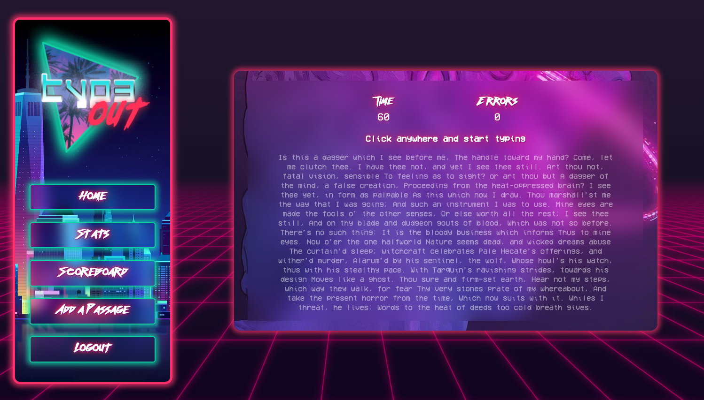

# Typ3out
by [Elisheva](https://github.com/elishevaelbaz) and [Dina](https://github.com/dinadeljanin)  

[Live: typ3out.netlify.app](https://typ3out.netlify.app/) 

Typ3out is an app to practice and test typing speed and accuracy.  

Users are able to:
- create an account or log in
- practice their typing speed and accuracy by taking timed typing tests
- view their past scores
- view the leaderboard and aim to see thier name among the top 10
- create new typing tests by uploading passages

### Built with

- [Frontend:](https://github.com/elishevaelbaz/typer-frontend) React.js   
- [Backend:](https://github.com/elishevaelbaz/typer-backend) Ruby On Rails, PostgreSQL  

### Getting started
#### To run on your local machine:

#### Prerequisites:
- Node.js
- npm
- Ruby on Rails
- PostgreSQL

#### Instructions:  
Clone both the [frontend](https://github.com/elishevaelbaz/typer-frontend) and the [backend](https://github.com/elishevaelbaz/typer-backend) repositories onto your machine using `git clone`.  

`cd` into the backend repository  
Run `bundle install` to download the necessary gems.  
Run `rails db:create && rails db:migrate` to create the database and the migrations.  
Run `rails db:seed` to seed the database.  
Run `rails s` to start the rails server (it will run on on PORT 3000)  

`cd` into the frontend repository:  
`cd` into the `typer` folder
Run `npm install` to install the necessary package dependencies  
Run `npm start` to run the app in development mode  
Follow the prompt to allow React to run on PORT 3001  
